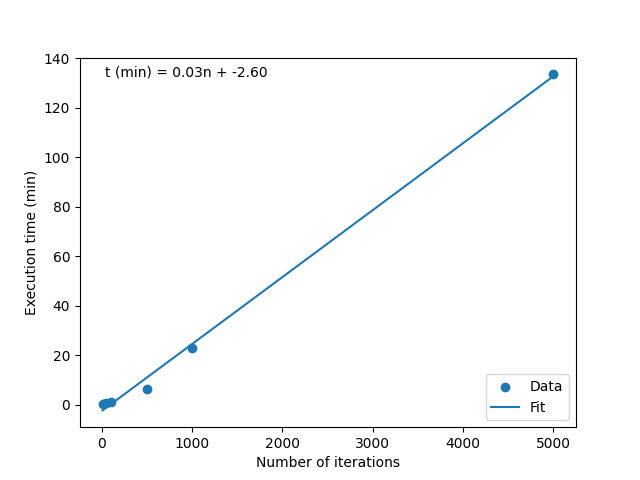
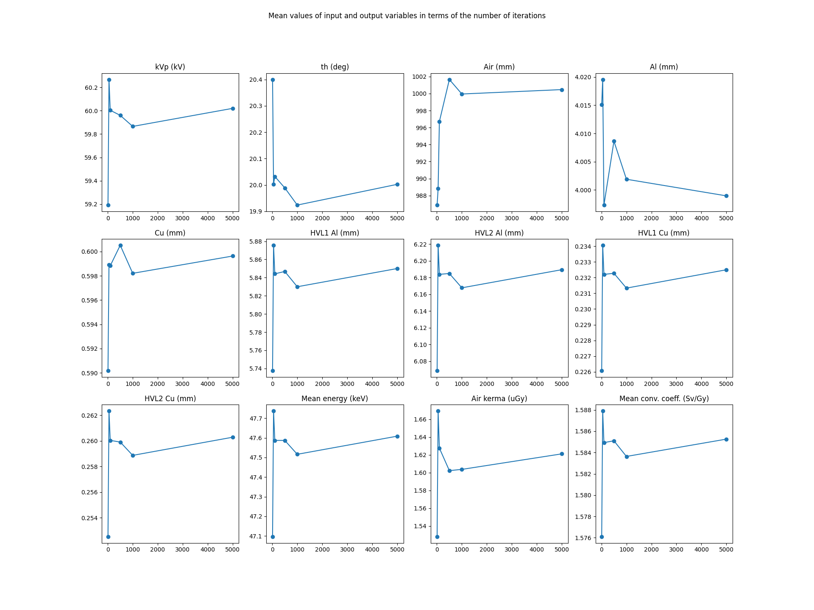
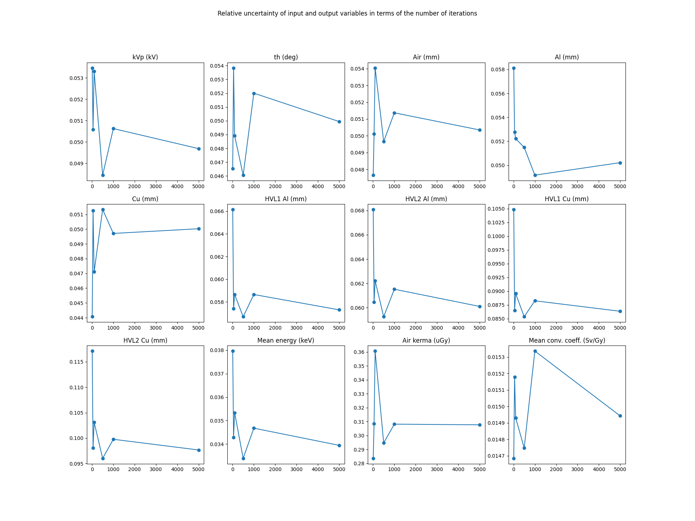
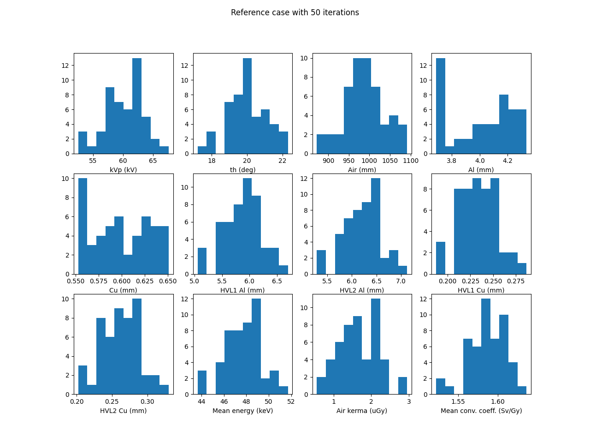
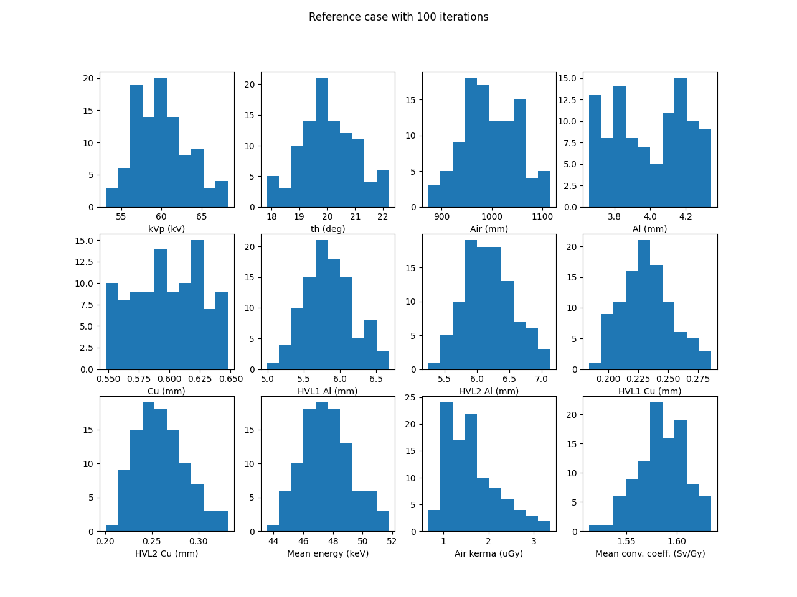
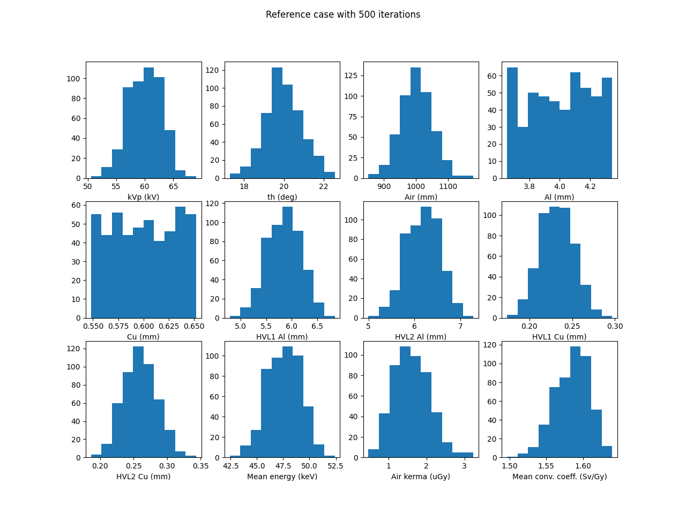
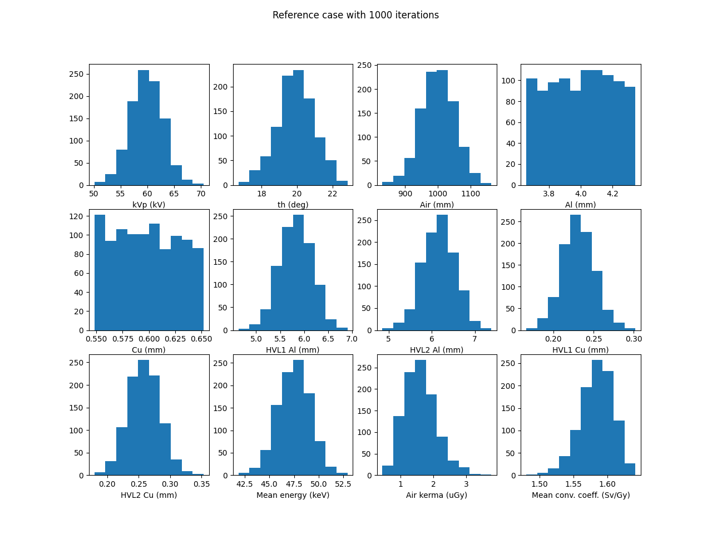
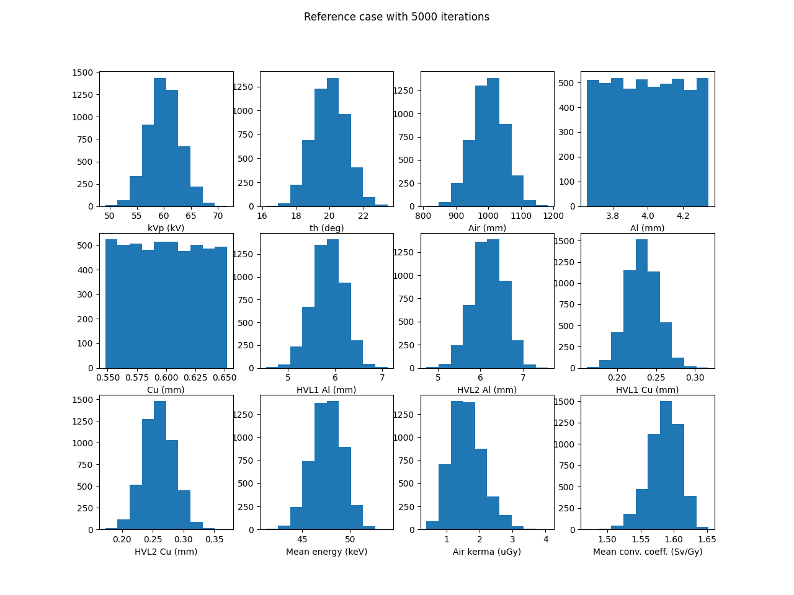

# Analysis of USpekPy in terms of the number of iterations

## Table of Contents
- [Introduction](#introduction)
- [Execution time](#execution-time)
- [Quantities mean values](#quantities-mean-values)
- [Quantities uncertainties](#quantities-uncertainties)
- [Probability distribution of input and output variables](#probability-distribution-of-input-and-output-variables)

## Introduction

In this study we use USpekPy version 1.0.3 to compute integral quantities for a reference case with different number of 
iterations.
The goal is to evaluate how different variables vary in terms of the number of iterations: execution time, probability 
distribution of input and output variables and the values and uncertainties of calculated integral quantities. 
The reference case considers the x-ray radiation quality N-60, the operational quantity H*(10) at 0º irradiation angle, 
mass energy transfer coefficients from PENELOPE, and mono energetic air kerma-to-dose-equivalent conversion coefficients
from ISO. 
Uncertainties are set to 5%, uncertainties 5% for all quantities, except for mono energetic air kerma-to-dose-equivalent 
conversion coefficients, since USpekPy does not include the contribution to the uncertainty of their variation.

## Execution time

Between 10 and 5000 iterations the variation of the execution is linear.
Please note that these values of execution time are obtained for a specific computer. 
They may vary from one computer to another.
PC specifications: processor Intel® Core™ i7-4790 × 8, RAM 8 GiB, OS Ubuntu 24.04 LTS.  

## Quantities mean values

## Quantities uncertainties

## Probability distribution of input and output variables

The number of iterations must be at least 500 to get adequate probability distribution in the random sampling.
Randomly sampled values of mass transfer coefficients are not included in the analysis, since USpekPy does not return 
their values.

