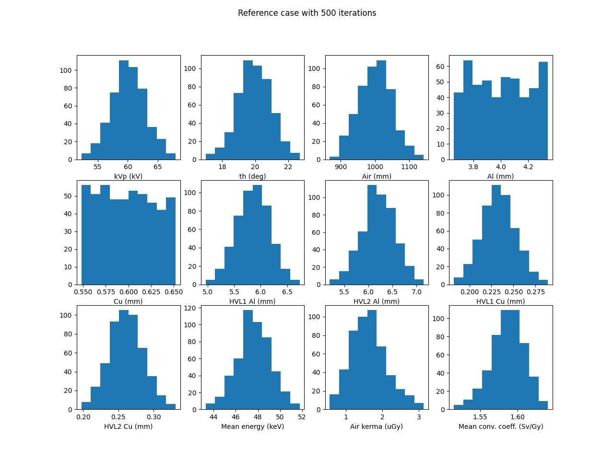

# Analysis of USpekPy in terms of the number of iterations

_**Author**: Xandra Campo_

_**Date**: July 2024_

_**Affiliation**: Ionizing Radiation Metrology Laboratory (LMRI), CIEMAT_

## Table of Contents

- [Introduction](#introduction)
- [Materials and methods](#materials-and-methods)
  - [Reference study case](#reference-study-case)
  - [Generate a data set](#generate-a-data-set)
  - [Data set analysis](#data-set-analysis)
  - [Reference materials](#reference-materials)
- [Results and discussion](#results-and-discussion)
  - [Execution time](#execution-time)
  - [Mean values of input and output variables](#mean-values-of-input-and-output-variables)
  - [Uncertainties of input and output variables](#uncertainties-of-input-and-output-variables)
  - [Probability distribution of input and output variables](#probability-distribution-of-input-and-output-variables)
- [Conclusions](#conclusions)

## Introduction

USpekPy uses **MonteCarlo techniques** to compute the uncertainties of integral quantities for x-ray spectra.
It is a numeric process.
Therefore, it is key to know **how many iterations** are necessary to get statistically adequate results,
and **how much time** is this going to take.
The **goal** of this study is to answer these questions.

These questions are interesting for USpekPy **users** for obvious reasons.
When running a Monte Carlo simulation, you want to get an equilibrium between execution time and results accuracy.
They are also interesting for USpekPy **developers**, since it would help to identify possible enhancements in the
software,
as well as software limitations.

In order to address these questions, we need to evaluate **how USpekPy behaves in terms of the number of iterations**.
In this study we use USpekPy version 1.0.3 to compute integral quantities with uncertainties for a single x-ray
spectrum with different number of iterations.
Evaluated behaviours are:

- Execution time for computing the integral quantities.
- Probability distribution of randomly sampled input variables.
- Probability distribution of calculated integral quantities.
- Mean values and uncertainties of calculated integral quantities.

With this information, we want to estimate the **minimum number of iterations** to get statistically adequate results,
when using USpekPy to compute integral quantities with uncertainties for an x-ray spectrum.
We also want to estimate of the **execution time** that this calculation requires.

## Materials and methods

### Reference study case

The **reference case** chosen for evaluation considers:

- The x-ray radiation quality N-60 (kVp of 60 kV and filtration thickness of 4 mm Al and 0.6 mm Cu).
- An x-ray tube anode of 20º.
- A distance of 1 m from the x-ray tube.
- The operational quantity H*(10) at 0º irradiation angle.
- Mass energy transfer coefficients for air in terms of the energy calculated with PENELOPE.
- Mono energetic air kerma-to-dose-equivalent conversion coefficients from ISO 4037.

**Uncertainties** are set to 5% for all quantities, except for mono energetic air kerma-to-dose-equivalent conversion
coefficients, since USpekPy does not include the contribution to the uncertainty of their variation.
These are the input variables for USpekPy.

### Generate a data set

First we **generate a set of data**.
We use USpekPy to calculate integral quantities with uncertainties for the reference case described before.
We run multiple simulations varying the number of iterations in each simulation **from 10 to 10,000 iterations**.
For each simulation we compute the quantities:

- First and second HVL for Al and Cu.
- Mean energy of the spectrum.
- Air kerma at 1 m distance from the x-ray tube.
- Mean air kerma-to-dose-equivalent conversion coefficient for H*(10) at 0º irradiation angle.

These are the **output variables** provided by USpekpy.
Simulations results are stored in CSV files for later analysis.
For each simulation, USpekPy provides a table with the calculated values of all the input and output variables,
as well as the statistical mean value and standard uncertainty.
We also **measure the execution time** for each simulation and store it for later analysis.

### Data set analysis

Once we have the set of data, we analyze it to infer the behaviour of USpekPy in terms of the number of simulations.
We want to evaluate different behaviours of USpekPy in terms of the number of iterations:

- **Execution time for computing the integral quantities**:
  We want to know how the execution time is related with the number of iterations,
  in order to be able to estimate execution times.
- **Probability distribution of randomly sampled input variables**:
  We want to know when the randomly sampled input variables get a proper probability distribution.
  This means a uniform distribution for filtration thicknesses and a normal distribution for the rest of the input
  variables.
- **Probability distribution of calculated integral quantities**:
  We want to know how is the probability distribution of the output variables.
  We also want to know when a proper probability distribution shape is obtained.
- **Mean values and uncertainties of calculated integral quantities**.
  We want to know if the mean values and uncertainties in terms of the number of iteration get to a plateau.
  If they get to a plateau, which is want we expect, we want to know when this happens.

### Reference materials

This study is developed using Python 3.12. The data and scripts used for this study, as well as the results,
can be found at [GitHub](https://github.com/xandratxan/using-uspekpy).

## Results and discussion

### Execution time

Figures 1 shows the measured execution time of USpekPy to compute integral quantities with uncertainties for an
x-ray spectrum in terms of the numbers of iterations, specifically between 10 and 10,000 iterations.
Figure 1a shows the data in linear scale, while Figure 1b shows the data using a logarithmic scale in the x-axis to
improve the visibility of the data.
The figures also shows that the data can be fitted to a linear model. The model's equation is also shown in the Figure.

Therefore, as we expected, **the variation of the execution is linear**.
It varies approximately from 8 s for 10 iterations to 2 h for 10,000 iterations.

Please note that these values of **execution time** are obtained for a specific computer.
They **may vary from one computer to another**.
These results are obtained using a PC with processor Intel® Core™ i7-4790 × 8, RAM 8 GiB, and OS Ubuntu 24.04 LTS.

_(a) Linear scale._

_(b) Logarithmic scale in the x-axis._

_Figure 1: Execution time of USpekPy to compute integral quantities with uncertainties for an x-ray spectrum
in terms of the numbers of iterations._

### Mean values of input and output variables

Figure 2 shows the mean values of input and output variables of USpekPy when computing integral quantities with
uncertainties for an x-ray spectrum in terms of the numbers of iterations.
Figure 2a shows the data in linear scale, while Figure 2b shows the data using a logarithmic scale in the x-axis to
improve the visibility of the data.

Figure 2a shows clearly that mean values for **all variables get to a plateau**.
It also shows that for 2000 iterations the plateau is fully reached.
To better see the variation around 2000 iterations, we can go to Figure 2b.
This figure shows that the plateau is not reached before **1000 iterations**.

Therefore, in order to get stable values of the mean values of input and output variables, 
it would be desirable to run at least **1000 iterations**.
This means approximately **12 minutes** of execution time per evaluated x-ray spectrum.

_(a) Linear scale._

_(b) Logarithmic scale in the x-axis._

_Figure 2: Mean values of input and output variables of USpekPy when computing integral quantities with uncertainties
for an x-ray spectrum in terms of the numbers of iterations._

### Uncertainties of input and output variables

Figure 3 shows the relative uncertainties of input and output variables of USpekPy when computing integral quantities
with
uncertainties for an x-ray spectrum in terms of the numbers of iterations.
Figure 3a shows the data in linear scale, while Figure 3b shows the data using a logarithmic scale in the x-axis to
improve the visibility of the data.

Figure 3a shows clearly that mean values for **all variables get to a plateau**.
It also shows that for 2000 iterations the plateau is fully reached.
To better see the variation around 2000 iterations, we can go to Figure 3b.
This figure shows that the plateau is not reached before **500 iterations**.

Therefore, in order to get stable values of the uncertainties of input and output variables, 
it would be desirable to run at least **500 iterations**.
This means approximately **6 minutes** of execution time per evaluated x-ray spectrum.

_(a) Linear scale._

_(b) Logarithmic scale in the x-axis._

_Figure 3: Relative uncertainties of input and output variables of USpekPy when computing integral quantities with
uncertainties for an x-ray spectrum in terms of the numbers of iterations._

## Probability distribution of input and output variables

Figure 4 shows in consecutive plots the probability distribution of input and output variables of USpekPy when computing
integral quantities with uncertainties for an x-ray spectrum in for iterations from 10 to 10,000.
Please note that randomly sampled values of mass transfer coefficients are not included in the analysis, 
since USpekPy does not return their values.

According to this Figure, the evolution of the distributions shape can be divided in three periods:
- **Before 70 iterations**, normal and uniform distributions are hardly recognizable in the probability distributions.
- **Between 70 and 200 iterations**, probability distributions begins to resemble normal or uniform distributions. 
- **After 300 iterations**, normal and uniform distributions are clearly recognizable in the probability distributions.

After 300 iterations, we can observe that the input variables show the expected probability distribution:
**uniform distribution** for filtration thicknesses and **normal distribution** for the rest of the input variables.
All output variables show **normal distributions**.

Therefore, in order to get adequate probability distributions in the random sampling, 
it would be desirable to run at least **300 iterations**.
This means approximately **3.5 minutes** of execution time per evaluated x-ray spectrum.

_Figure 4: Probability distribution of input and output variables of USpekPy when computing integral quantities with
uncertainties for an x-ray spectrum in terms of the numbers of iterations._

## Conclusions

**Execution time**:
The variation of the execution is linear.
It varies approximately from 8 s for 10 iterations to 2 h for 10,000 iterations.

**Mean values of input and output variables**:
In order to get stable values of the mean values of input and output variables, 
it would be desirable to run at least 1000 iterations.
This means approximately 12 minutes of execution time per evaluated x-ray spectrum.

**Uncertainties of input and output variables**:
In order to get stable values of the uncertainties of input and output variables, 
it would be desirable to run at least 500 iterations.
This means approximately 6 minutes of execution time per evaluated x-ray spectrum.

**Probability distribution of input and output variables**:
In order to get adequate probability distributions in the random sampling, 
it would be desirable to run at least 300 iterations.
This means approximately 3.5 minutes of execution time per evaluated x-ray spectrum.

Since the main goal of USpekPy is the calculation of the uncertainties of integral quantities, 
and mean values can be calculated analytically or with other software tools 
(like USpekPy's SpekWrapper class or the SpekPy package)
we would recommend to **run at least 500 iterations** per evaluated x-ray spectrum.